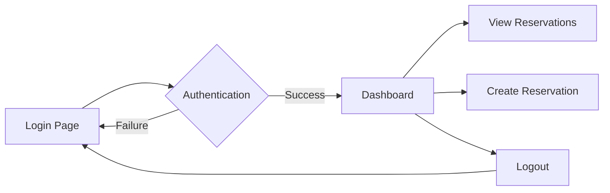

## Overview

The `DashboardController` manages the main dashboard interface that users see after successful authentication. It serves as the central hub for authenticated users to access various features of the Apartado de Salas system.

**Location:** `app/controllers/DashboardController.php`

---

## Methods

### index()

Displays the main dashboard view. Requires user authentication.

<ParamField path="return" type="void">
  Renders the dashboard view
</ParamField>

**Route Mapping:**
```php
GET /dashboard -> DashboardController::index()
```

**Method Signature:**
```php
public function index(): void
```

**Implementation:**
```php
Auth::requireLogin();

require_once dirname(__DIR__) . '/views/dashboard/index.php';
```

<Note>
  This method requires an active user session. Unauthenticated users will be redirected to the login page by the `Auth::requireLogin()` helper.
</Note>

---

## Access Control

### Authentication Requirement

All dashboard routes require authentication:

```php
Auth::requireLogin();
```

**Behavior:**
- **If authenticated:** Dashboard view is rendered
- **If not authenticated:** User is redirected to `/login`

---

## Route Details

### GET /dashboard

**Controller:** `DashboardController`  
**Method:** `index()`  
**Authentication:** Required  
**Authorization:** Any authenticated user

**Flow:**
1. User navigates to `/dashboard`
2. `Auth::requireLogin()` verifies active session
3. If valid session exists, dashboard view is loaded
4. If no valid session, redirect to `/login`

---

## Dashboard Features

The dashboard typically provides access to:

<Tabs>
  <Tab title="Regular Users">
    - View their own reservations
    - Create new reservations
    - Check reservation status
    - Access room availability
  </Tab>
  
  <Tab title="Administrators">
    - All regular user features
    - View all reservations
    - Approve/reject pending reservations
    - Manage rooms and materials
    - View system statistics
  </Tab>
</Tabs>

---

## Dependencies

```php
require_once dirname(__DIR__) . '/Helpers/Session.php';
require_once dirname(__DIR__) . '/Helpers/Auth.php';
```

**Required Classes:**
- `Session` - Helper for session management
- `Auth` - Helper for authentication verification

---

## Usage Flow

### Typical User Journey



### Code Example: Redirect After Login

```php
// From AuthController::login()
if ($authResult) {
    Session::create($authResult);
    
    // Redirect to dashboard after successful login
    header('Location: ' . BASE_URL . '/dashboard');
    exit;
}
```

### Code Example: Protected Dashboard Access

```php
// From DashboardController::index()
public function index(): void
{
    // Verify user is logged in
    Auth::requireLogin();
    
    // If execution reaches here, user is authenticated
    // Load the dashboard view
    require_once dirname(__DIR__) . '/views/dashboard/index.php';
}
```

---

## Session Data Available

When the dashboard loads, the following session data is typically available:

```php
$_SESSION['user'] = [
    'id' => 1,
    'username' => 'john_doe',
    'role' => 'admin',  // or 'user'
    'email' => 'john@example.com',
    // ... other user fields
];
```

**Accessing Session Data in Views:**

```php
// Get current user's name
$username = $_SESSION['user']['username'] ?? 'Guest';

// Check if user is admin
$isAdmin = ($_SESSION['user']['role'] ?? '') === 'admin';

// Get user ID for queries
$userId = $_SESSION['user']['id'] ?? null;
```

---

## Integration Points

The dashboard serves as the central navigation hub, linking to:

### Reservation Management
```php
// Create new reservation
GET /reservations/create -> ReservationController::create()

// View user's reservations
GET /reservations/mine -> ReservationController::mine()
```

### Admin Functions (if user has admin role)
```php
// View all reservations
GET /reservations -> ReservationController::index()

// View specific reservation details
GET /reservations/show?id={id} -> ReservationController::show()
```

### Authentication
```php
// Logout
GET /logout -> AuthController::logout()
```

---

## Security Considerations

<Note>
  The dashboard controller implements minimal business logic by design. All authentication and authorization checks are delegated to the `Auth` helper class, following the single responsibility principle.
</Note>

**Security Features:**

1. **Session Verification**
   - Every request checks for active session via `Auth::requireLogin()`
   - Invalid or expired sessions redirect to login

2. **Role-Based Access**
   - Dashboard adapts content based on user role
   - Admin-only features are hidden from regular users

3. **No Direct Database Access**
   - Dashboard controller doesn't query database directly
   - All data fetching delegated to appropriate models/controllers

---

## Example Dashboard View Structure

```php
<!-- views/dashboard/index.php -->
<?php
$user = $_SESSION['user'] ?? null;
$isAdmin = ($user['role'] ?? '') === 'admin';
?>

<div class="dashboard">
    <h1>Bienvenido, <?= htmlspecialchars($user['username']) ?></h1>
    
    <nav>
        <a href="<?= BASE_URL ?>/reservations/create">Nueva Reservación</a>
        <a href="<?= BASE_URL ?>/reservations/mine">Mis Reservaciones</a>
        
        <?php if ($isAdmin): ?>
            <a href="<?= BASE_URL ?>/reservations">Todas las Reservaciones</a>
        <?php endif; ?>
        
        <a href="<?= BASE_URL ?>/logout">Cerrar Sesión</a>
    </nav>
    
    <!-- Dashboard content -->
</div>
```