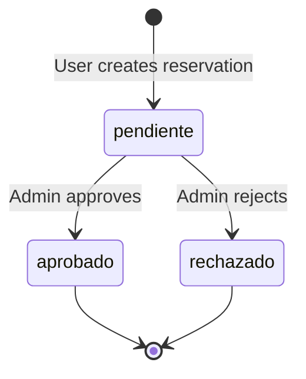

## Overview

The `ReservationController` handles all reservation-related operations in the Apartado de Salas system. It manages the complete lifecycle of room reservations including creation with time slots, material assignments, admin approval/rejection workflows, and listing for both users and administrators.

**Location:** `app/controllers/ReservationController.php`

---

## Methods

### create()

Displays the reservation creation form. Requires user authentication.

<ParamField path="return" type="void">
  Renders the reservation creation view
</ParamField>

**Route Mapping:**
```php
GET /reservations/create -> ReservationController::create()
```

**Method Signature:**
```php
public function create(): void
```

**Implementation:**
```php
Auth::requireLogin();

require_once dirname(__DIR__) . '/views/reservations/create.php';
```

---

### store()

Processes the creation of a new reservation with multiple time slots and materials. Uses database transactions to ensure data integrity.

<ParamField path="room_id" type="int" required>
  ID of the room to reserve (`$_POST['room_id']`)
</ParamField>

<ParamField path="event_name" type="string" required>
  Name of the event (`$_POST['event_name']`)
</ParamField>

<ParamField path="notes" type="string">
  Optional notes for the reservation (`$_POST['notes']`)
</ParamField>

<ParamField path="dates" type="array" required>
  Array of dates for reservation slots (`$_POST['dates']`)
</ParamField>

<ParamField path="start_times" type="array" required>
  Array of start times for each date (`$_POST['start_times']`)
</ParamField>

<ParamField path="end_times" type="array" required>
  Array of end times for each date (`$_POST['end_times']`)
</ParamField>

<ParamField path="materials" type="array">
  Array of material IDs to assign (`$_POST['materials']`)
</ParamField>

<ParamField path="return" type="void">
  Redirects to dashboard on success or back to form with error
</ParamField>

**Route Mapping:**
```php
POST /reservations/store -> ReservationController::store()
```

**Method Signature:**
```php
public function store(): void
```

**Implementation Flow:**

<Tabs>
  <Tab title="Data Collection">
    ```php
    Auth::requireLogin();

    // Get form data
    $userId   = $_SESSION['user']['id'] ?? null;
    $roomId   = $_POST['room_id'] ?? null;
    $event    = trim($_POST['event_name'] ?? '');
    $notes    = trim($_POST['notes'] ?? '');

    $dates       = $_POST['dates'] ?? [];      // array
    $startTimes  = $_POST['start_times'] ?? []; // array
    $endTimes    = $_POST['end_times'] ?? [];   // array
    $materials   = $_POST['materials'] ?? [];   // array
    $materials   = array_map('intval', $materials);
    ```
  </Tab>
  
  <Tab title="Validation">
    ```php
    // Validate required fields
    if (!$userId || !$roomId || empty($event)) {
        Session::setFlash('error', 'Datos incompletos.');
        header('Location: '. BASE_URL . '/reservations/create');
        exit;
    }

    if (count($dates) === 0) {
        Session::setFlash('error', 'Debe agregar al menos un horario.');
        header('Location: '. BASE_URL . '/reservations/create');
        exit;
    }
    ```
  </Tab>
  
  <Tab title="Transaction">
    ```php
    // Initialize models
    $reservationModel = new Reservation();
    $slotModel        = new ReservationSlot();
    $materialModel    = new Material();

    try {
        $db = Database::getConnection();
        $db->beginTransaction();

        // Create reservation record
        $reservationId = $reservationModel->create(
            $userId,
            (int)$roomId,
            $event,
            $notes ?: null
        );

        // Create time slots
        foreach ($dates as $index => $date) {
            $start = $startTimes[$index] ?? null;
            $end   = $endTimes[$index] ?? null;

            if (!$date || !$start || !$end) {
                throw new Exception('Bloque horario incompleto.');
            }

            if ($slotModel->hasConflict((int)$roomId, $date, $start, $end)) {
                throw new Exception("Conflicto de horario el $date de $start a $end.");
            }

            $slotModel->create($reservationId, $date, $start, $end);
        }

        // Validate and assign materials
        if (!$materialModel->validateForRoom($materials, (int)$roomId)) {
            throw new Exception('Seleccionaste materiales no válidos para la sala.');
        }

        $reservationModel->attachMaterials($reservationId, $materials);

        // Commit transaction
        $db->commit();
        
        Session::setFlash('success', 'La reservación fue creada correctamente.');
        header('Location:'. BASE_URL.'/dashboard');
        exit;

    } catch (Exception $e) {
        if(isset($db) && $db->inTransaction()) {
            $db->rollBack();
        }

        Session::setFlash('error', $e->getMessage());
        header('Location: ' . BASE_URL . '/reservations/create');
        exit;
    }
    ```
  </Tab>
</Tabs>

<Note>
  This method uses database transactions to ensure all operations (reservation creation, slot creation, material assignment) succeed or fail together.
</Note>

**Possible Error Messages:**
- `"Datos incompletos."` - Missing required fields
- `"Debe agregar al menos un horario."` - No time slots provided
- `"Bloque horario incompleto."` - Missing date, start time, or end time for a slot
- `"Conflicto de horario el {date} de {start} a {end}."` - Time slot conflicts with existing reservation
- `"Seleccionaste materiales no válidos para la sala."` - Invalid materials for the selected room

---

### index()

Lists all reservations for administrators with optional status filtering.

<ParamField path="status" type="string">
  Optional status filter (`$_GET['status']`). Valid values: `pendiente`, `aprobado`, `rechazado`
</ParamField>

<ParamField path="return" type="void">
  Renders the reservations index view
</ParamField>

**Route Mapping:**
```php
GET /reservations -> ReservationController::index()
```

**Method Signature:**
```php
public function index(): void
```

**Implementation:**
```php
// Only admins
Auth::requireRole('admin');

$reservationModel = new Reservation();

// Optional status filter
$status = $_GET['status'] ?? null;

if ($status) {
    $reservations = $reservationModel->getByStatus($status);
} else {
    $reservations = $reservationModel->getAll();
}

require_once dirname(__DIR__) . '/views/reservations/index.php';
```

<Note>
  Only users with `admin` role can access this method.
</Note>

---

### getByStatus()

<Warning>
**Deprecated/Unused Method**: This method exists in the controller source code (lines 143-171) but is never called by any route. The `index()` method instead uses the Reservation model's `getByStatus()` method. See [Reservation Model](/api/reservation-model#getbystatus) for the actively used implementation.
</Warning>

This method retrieves reservations filtered by status with joined room and user information.

<ParamField path="status" type="string" required>
  Status to filter by: `pendiente`, `aprobado`, or `rechazado`
</ParamField>

<ParamField path="return" type="array">
  Array of reservation records with room and user details
</ParamField>

**Method Signature:**
```php
public function getByStatus(string $status): array
```

**Note**: In practice, use the Reservation model method via:
```php
$reservationModel = new Reservation();
$reservations = $reservationModel->getByStatus($status);
```

---

### approve()

Approves a pending reservation. Admin-only operation.

<ParamField path="id" type="int" required>
  Reservation ID to approve (`$_POST['id']`)
</ParamField>

<ParamField path="return" type="void">
  Redirects back to reservations list with success message
</ParamField>

**Route Mapping:**
```php
POST /reservations/approve -> ReservationController::approve()
```

**Method Signature:**
```php
public function approve(): void
```

**Implementation:**
```php
Auth::requireRole('admin');

// Validate POST request
if ($_SERVER['REQUEST_METHOD'] !== 'POST') {
    header('Location: ' . BASE_URL . '/reservations');
    exit;
}

// Get ID
$id = $_POST['id'] ?? null;

if (!$id) {
    Session::setFlash('error', 'Solicitud inválida.');
    header('Location: ' . BASE_URL . '/reservations');
    exit;
}

// Update status
$reservationModel = new Reservation();
$reservationModel->updateStatus((int)$id, 'aprobado');

// Feedback
Session::setFlash('success', 'Solicitud aprobada correctamente.');

// Redirect
header('Location: ' . BASE_URL . '/reservations');
exit;
```

---

### reject()

Rejects a pending reservation. Admin-only operation.

<ParamField path="id" type="int" required>
  Reservation ID to reject (`$_POST['id']`)
</ParamField>

<ParamField path="return" type="void">
  Redirects back to reservations list with success message
</ParamField>

**Route Mapping:**
```php
POST /reservations/reject -> ReservationController::reject()
```

**Method Signature:**
```php
public function reject(): void
```

**Implementation:**
```php
Auth::requireRole('admin');

// Validate POST request
if ($_SERVER['REQUEST_METHOD'] !== 'POST') {
    header('Location: ' . BASE_URL . '/reservations');
    exit;
}

// Get ID
$id = $_POST['id'] ?? null;

if (!$id) {
    Session::setFlash('error', 'Solicitud inválida.');
    header('Location: ' . BASE_URL . '/reservations');
    exit;
}

// Update status
$reservationModel = new Reservation();
$reservationModel->updateStatus((int)$id, 'rechazado');

// Feedback
Session::setFlash('success', 'Solicitud rechazada.');

// Redirect
header('Location: ' . BASE_URL . '/reservations');
exit;
```

---

### mine()

Displays all reservations created by the currently authenticated user.

<ParamField path="return" type="void">
  Renders the user's reservations view
</ParamField>

**Route Mapping:**
```php
GET /reservations/mine -> ReservationController::mine()
```

**Method Signature:**
```php
public function mine(): void
```

**Implementation:**
```php
Auth::requireLogin();

$userId = $_SESSION['user']['id'] ?? null;

if (!$userId) {
    Session::setFlash('error', 'Sesión inválida');
    header('Location: ' . BASE_URL . '/login');
    exit;
}

$reservationModel = new Reservation();
$reservations = $reservationModel->getByUser($userId);

require_once dirname(__DIR__) . '/views/reservations/mine.php';
```

---

### show()

Displays detailed information about a specific reservation including time slots and materials. Admin-only.

<ParamField path="id" type="int" required>
  Reservation ID to display (`$_GET['id']`)
</ParamField>

<ParamField path="return" type="void">
  Renders the reservation detail view
</ParamField>

**Route Mapping:**
```php
GET /reservations/show -> ReservationController::show()
```

**Method Signature:**
```php
public function show(): void
```

**Implementation:**
```php
Auth::requireRole('admin');

$id = $_GET['id'] ?? null;

if (!$id) {
    Session::setFlash('error', 'Solicitud no válida.');
    header('Location: ' . BASE_URL . '/reservations');
    exit;
}

$reservationModel = new Reservation();

$reservation = $reservationModel->findById((int)$id);
$slots = $reservationModel->getSlots((int)$id);
$materials = $reservationModel->getMaterials((int)$id);

if (!$reservation) {
    Session::setFlash('error', 'Solicitud no encontrada.');
    header('Location: ' . BASE_URL . '/reservations');
    exit;
}

require_once dirname(__DIR__) . '/views/reservations/show.php';
```

---

## Dependencies

```php
require_once dirname(__DIR__) . '/models/Reservation.php';
require_once dirname(__DIR__) . '/models/ReservationSlot.php';
require_once dirname(__DIR__) . '/models/Material.php';
require_once dirname(__DIR__) . '/Helpers/Session.php';
require_once dirname(__DIR__) . '/Helpers/Auth.php';
require_once dirname(__DIR__) . '/core/Database.php';
```

**Required Classes:**
- `Reservation` - Model for reservation management
- `ReservationSlot` - Model for time slot management
- `Material` - Model for material management
- `Session` - Helper for session management
- `Auth` - Helper for authentication and authorization
- `Database` - Database connection handler

---

## Reservation Status Flow



**Status Values:**
- `pendiente` - Newly created, awaiting admin review
- `aprobado` - Approved by administrator
- `rechazado` - Rejected by administrator