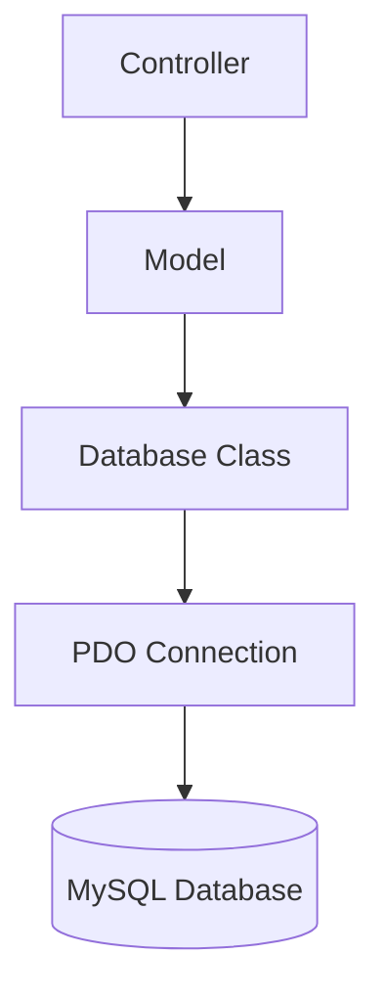

Apartado de Salas uses PDO (PHP Data Objects) for database connectivity, providing a secure, object-oriented interface to MySQL. The database layer implements the Singleton pattern to ensure a single connection per request.

## Database Architecture

The database layer consists of two main components:

1. **Database Class** - Manages PDO connection (Singleton pattern)
2. **Model Classes** - Encapsulate queries and business logic



## Database Class

The `Database` class provides a centralized connection manager:

```php app/core/Database.php
<?php

class Database
{
    private static ?PDO $connection = null;

    /**
     * Returns an active PDO connection
     */
    public static function getConnection(): PDO
    {
        if (self::$connection === null) {
            self::connect();
        }

        return self::$connection;
    }

    /**
     * Creates the PDO connection
     */
    private static function connect(): void
    {
        $config = require dirname(__DIR__) . '/config/database.php';

        $dsn = "mysql:host={$config['host']};dbname={$config['dbname']};charset={$config['charset']}";

        try {
            self::$connection = new PDO(
                $dsn,
                $config['user'],
                $config['password'],
                [
                    PDO::ATTR_ERRMODE            => PDO::ERRMODE_EXCEPTION,
                    PDO::ATTR_DEFAULT_FETCH_MODE => PDO::FETCH_ASSOC,
                ]
            );
        } catch (PDOException $e) {
            die('Error de conexión a la base de datos');
        }
    }
}
```

### Singleton Pattern

The Database class implements the Singleton pattern to ensure only one connection exists:

<Tabs>
  <Tab title="Static Property">
    A static property stores the single connection:
    
    ```php
    private static ?PDO $connection = null;
    ```
    
    This property is shared across all instances and requests.
  </Tab>
  
  <Tab title="Lazy Initialization">
    The connection is created only when first needed:
    
    ```php
    public static function getConnection(): PDO
    {
        if (self::$connection === null) {
            self::connect();
        }
        return self::$connection;
    }
    ```
  </Tab>
  
  <Tab title="Private Constructor">
    The `connect()` method is private to prevent external instantiation:
    
    ```php
    private static function connect(): void
    {
        // Connection logic
    }
    ```
  </Tab>
</Tabs>

<Info>
The Singleton pattern prevents connection overhead by reusing the same PDO instance throughout the request lifecycle.
</Info>

## PDO Configuration

The Database class configures PDO with secure defaults:

### DSN (Data Source Name)

```php
$dsn = "mysql:host={$config['host']};dbname={$config['dbname']};charset={$config['charset']}";
```

The DSN specifies:
- **host** - Database server hostname (e.g., `localhost`)
- **dbname** - Database name (e.g., `apartado_salas`)
- **charset** - Character encoding (e.g., `utf8mb4`)

### PDO Attributes

Two critical attributes are configured:

```php
[
    PDO::ATTR_ERRMODE            => PDO::ERRMODE_EXCEPTION,
    PDO::ATTR_DEFAULT_FETCH_MODE => PDO::FETCH_ASSOC,
]
```

<Tabs>
  <Tab title="Error Mode">
    **ERRMODE_EXCEPTION** throws exceptions on database errors:
    
    ```php
    PDO::ATTR_ERRMODE => PDO::ERRMODE_EXCEPTION
    ```
    
    This allows proper error handling with try-catch blocks instead of checking return values.
  </Tab>
  
  <Tab title="Fetch Mode">
    **FETCH_ASSOC** returns rows as associative arrays:
    
    ```php
    PDO::ATTR_DEFAULT_FETCH_MODE => PDO::FETCH_ASSOC
    ```
    
    Example result:
    ```php
    [
        'id' => 1,
        'username' => 'admin',
        'email' => 'admin@example.com'
    ]
    ```
  </Tab>
</Tabs>

## Database Configuration

Database credentials are stored in `app/config/database.php`:

```php app/config/database.php
<?php

return [
    'host'     => 'localhost',
    'dbname'   => 'apartado_salas',
    'user'     => 'root',
    'password' => '',
    'charset'  => 'utf8mb4',
];
```

<Note>
**Security:** In production, database credentials should be stored in environment variables, not committed to version control.
</Note>

## Model Database Patterns

Models use the Database class to execute queries. Here are common patterns:

### Basic Query Pattern

Models obtain a PDO connection in the constructor:

```php
class Reservation
{
    private \PDO $db;

    public function __construct()
    {
        $this->db = Database::getConnection();
    }
}
```

### SELECT Queries

Using prepared statements to fetch data:

```php
public function findById(int $id): ?array
{
    $sql = "
        SELECT 
            r.id,
            r.user_id,
            r.room_id,
            r.event_name,
            r.status,
            r.notes,
            r.created_at,
            u.username,
            rm.name AS room_name
        FROM reservations r
        JOIN users u ON u.id = r.user_id
        JOIN rooms rm ON rm.id = r.room_id
        WHERE r.id = :id
        LIMIT 1
    ";

    $stmt = $this->db->prepare($sql);
    $stmt->bindParam(':id', $id, PDO::PARAM_INT);
    $stmt->execute();

    $reservation = $stmt->fetch(PDO::FETCH_ASSOC);

    return $reservation ?: null;
}
```

<Info>
The `?:` operator returns `null` if `fetch()` returns `false` (no results found).
</Info>

### INSERT Queries

Inserting data and returning the new ID:

```php
public function create(
    int $userId,
    int $roomId,
    string $eventName,
    ?string $notes = null
): int {
    $sql = "
        INSERT INTO reservations (user_id, room_id, event_name, notes)
        VALUES (:user_id, :room_id, :event_name, :notes)
    ";

    $stmt = $this->db->prepare($sql);
    $stmt->bindParam(':user_id', $userId, PDO::PARAM_INT);
    $stmt->bindParam(':room_id', $roomId, PDO::PARAM_INT);
    $stmt->bindParam(':event_name', $eventName);
    $stmt->bindParam(':notes', $notes);

    $stmt->execute();

    return (int) $this->db->lastInsertId();
}
```

### UPDATE Queries

Updating records with validation:

```php
public function updateStatus(int $reservationId, string $status): bool
{
    $allowedStatuses = ['pendiente', 'aprobado', 'rechazado'];

    if (!in_array($status, $allowedStatuses, true)) {
        throw new InvalidArgumentException('Estado de reservación inválido');
    }

    $sql = "
        UPDATE reservations
        SET status = :status
        WHERE id = :id
    ";

    $stmt = $this->db->prepare($sql);
    $stmt->bindParam(':status', $status);
    $stmt->bindParam(':id', $reservationId, PDO::PARAM_INT);

    return $stmt->execute();
}
```

### DELETE Queries

Deleting with prepared statements:

```php
public function delete(int $reservationId): void
{
    $this->db->prepare(
        "DELETE FROM reservation_materials WHERE reservation_id = :id"
    )->execute([':id' => $reservationId]);
}
```

## Prepared Statements

All queries use prepared statements to prevent SQL injection:

### Parameter Binding

<Tabs>
  <Tab title="bindParam()">
    Bind variables by reference:
    
    ```php
    $stmt = $this->db->prepare($sql);
    $stmt->bindParam(':id', $id, PDO::PARAM_INT);
    $stmt->execute();
    ```
    
    Changes to `$id` before `execute()` affect the query.
  </Tab>
  
  <Tab title="execute() Array">
    Pass parameters directly to execute:
    
    ```php
    $stmt = $this->db->prepare($sql);
    $stmt->execute([':id' => $reservationId]);
    ```
    
    Cleaner for simple queries with few parameters.
  </Tab>
</Tabs>

### Parameter Types

Specify parameter types for better security:

```php
$stmt->bindParam(':id', $id, PDO::PARAM_INT);        // Integer
$stmt->bindParam(':name', $name, PDO::PARAM_STR);    // String
$stmt->bindParam(':active', $active, PDO::PARAM_BOOL); // Boolean
```

<Note>
**Security:** Never concatenate user input into SQL queries. Always use prepared statements with parameter binding.
</Note>

## Query Result Handling

### Single Row Results

Use `fetch()` to retrieve a single row:

```php
$user = $stmt->fetch(PDO::FETCH_ASSOC);

if (!$user) {
    return false; // No user found
}

return $user; // Array with user data
```

### Multiple Row Results

Use `fetchAll()` to retrieve all rows:

```php
public function getAll(): array
{
    $sql = "
        SELECT 
            r.id,
            r.event_name,
            r.status,
            r.created_at,
            rm.name AS room_name,
            u.username
        FROM reservations r
        JOIN rooms rm ON rm.id = r.room_id
        JOIN users u ON u.id = r.user_id
        ORDER BY r.created_at DESC
    ";

    $stmt = $this->db->prepare($sql);
    $stmt->execute();

    return $stmt->fetchAll(PDO::FETCH_ASSOC);
}
```

## Advanced Patterns

### Batch Operations

Inserting multiple related records:

```php
public function attachMaterials(int $reservationId, array $materialIds): void
{
    // 1. Delete existing materials
    $this->db->prepare(
        "DELETE FROM reservation_materials WHERE reservation_id = :id"
    )->execute([':id' => $reservationId]);

    // 2. Normalize IDs
    $materialIds = array_unique(
        array_filter(
            array_map('intval', $materialIds),
            fn($id) => $id > 0
        )
    );

    // 3. Insert new materials
    $stmt = $this->db->prepare(
        "INSERT INTO reservation_materials (reservation_id, material_id)
        VALUES (:reservation_id, :material_id)"
    );

    foreach ($materialIds as $materialId) {
        $stmt->execute([
            ':reservation_id' => $reservationId,
            ':material_id'    => $materialId
        ]);
    }
}
```

### JOIN Queries

Fetching related data with JOINs:

```php
SELECT 
    r.id,
    r.event_name,
    r.status,
    u.username,           -- From users table
    rm.name AS room_name  -- From rooms table
FROM reservations r
JOIN users u ON u.id = r.user_id
JOIN rooms rm ON rm.id = r.room_id
WHERE r.status = :status
ORDER BY r.created_at DESC
```

### Subqueries

Fetching materials for a reservation:

```php
public function getMaterials(int $reservationId): array
{
    $sql = "
        SELECT m.id, m.name
        FROM reservation_materials rm
        JOIN materials m ON m.id = rm.material_id
        WHERE rm.reservation_id = :reservation_id
        ORDER BY m.name
    ";

    $stmt = $this->db->prepare($sql);
    $stmt->bindParam(':reservation_id', $reservationId, PDO::PARAM_INT);
    $stmt->execute();

    return $stmt->fetchAll(PDO::FETCH_ASSOC);
}
```

## Error Handling

PDO is configured to throw exceptions on errors:

```php
try {
    self::$connection = new PDO(
        $dsn,
        $config['user'],
        $config['password'],
        [
            PDO::ATTR_ERRMODE => PDO::ERRMODE_EXCEPTION,
        ]
    );
} catch (PDOException $e) {
    die('Error de conexión a la base de datos');
}
```

<Note>
**Production:** In production, log the actual error message and show a generic message to users. Never expose database errors publicly.
</Note>

## Security Best Practices

The database layer implements several security measures:

1. **Prepared Statements** - All queries use parameter binding
2. **Input Validation** - Models validate data before queries
3. **Type Safety** - PDO parameter types prevent type juggling
4. **Password Hashing** - Passwords never stored in plain text
5. **Sensitive Data Filtering** - Passwords removed from query results

### Password Security Example

```php
public function authenticate(string $username, string $password)
{
    $db = Database::getConnection();

    $sql = "
        SELECT id, username, email, password, role
        FROM users
        WHERE username = :username
        LIMIT 1
    ";

    $stmt = $db->prepare($sql);
    $stmt->bindParam(':username', $username, PDO::PARAM_STR);
    $stmt->execute();

    $user = $stmt->fetch();

    if (!$user) {
        return false;
    }

    // Verify password using password_verify()
    if (!password_verify($password, $user['password'])) {
        return false;
    }

    // Never return the password hash
    unset($user['password']);

    return $user;
}
```

## Database Schema

The application uses the following core tables:

```sql
-- Users
CREATE TABLE users (
    id INT PRIMARY KEY AUTO_INCREMENT,
    username VARCHAR(50) NOT NULL UNIQUE,
    email VARCHAR(100) NOT NULL,
    password VARCHAR(255) NOT NULL,
    role VARCHAR(20) NOT NULL
);

-- Rooms
CREATE TABLE rooms (
    id INT PRIMARY KEY AUTO_INCREMENT,
    name VARCHAR(100) NOT NULL,
    capacity INT NOT NULL
);

-- Reservations
CREATE TABLE reservations (
    id INT PRIMARY KEY AUTO_INCREMENT,
    user_id INT NOT NULL,
    room_id INT NOT NULL,
    event_name VARCHAR(200) NOT NULL,
    status ENUM('pendiente', 'aprobado', 'rechazado') DEFAULT 'pendiente',
    notes TEXT,
    created_at TIMESTAMP DEFAULT CURRENT_TIMESTAMP,
    FOREIGN KEY (user_id) REFERENCES users(id),
    FOREIGN KEY (room_id) REFERENCES rooms(id)
);

-- Materials
CREATE TABLE materials (
    id INT PRIMARY KEY AUTO_INCREMENT,
    room_id INT NOT NULL,
    name VARCHAR(100) NOT NULL,
    FOREIGN KEY (room_id) REFERENCES rooms(id)
);

-- Reservation Materials (many-to-many)
CREATE TABLE reservation_materials (
    reservation_id INT NOT NULL,
    material_id INT NOT NULL,
    PRIMARY KEY (reservation_id, material_id),
    FOREIGN KEY (reservation_id) REFERENCES reservations(id),
    FOREIGN KEY (material_id) REFERENCES materials(id)
);
```

## Performance Considerations

<Tabs>
  <Tab title="Connection Pooling">
    The Singleton pattern reuses connections:
    
    ```php
    // First call - creates connection
    $db = Database::getConnection();
    
    // Subsequent calls - reuses connection
    $db = Database::getConnection();
    ```
  </Tab>
  
  <Tab title="Query Optimization">
    Use LIMIT for single row queries:
    
    ```sql
    SELECT * FROM users WHERE id = :id LIMIT 1
    ```
  </Tab>
  
  <Tab title="Indexes">
    Create indexes on frequently queried columns:
    
    ```sql
    CREATE INDEX idx_username ON users(username);
    CREATE INDEX idx_status ON reservations(status);
    ```
  </Tab>
</Tabs>

## Next Steps

- [Architecture Overview](/architecture/overview) - Return to architecture overview
- [MVC Pattern](/architecture/mvc-pattern) - Learn how models fit into MVC