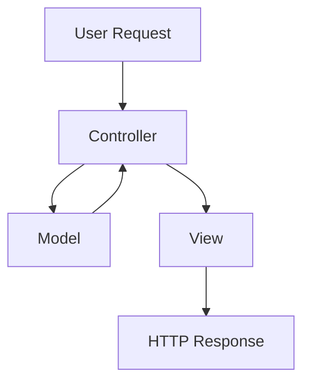
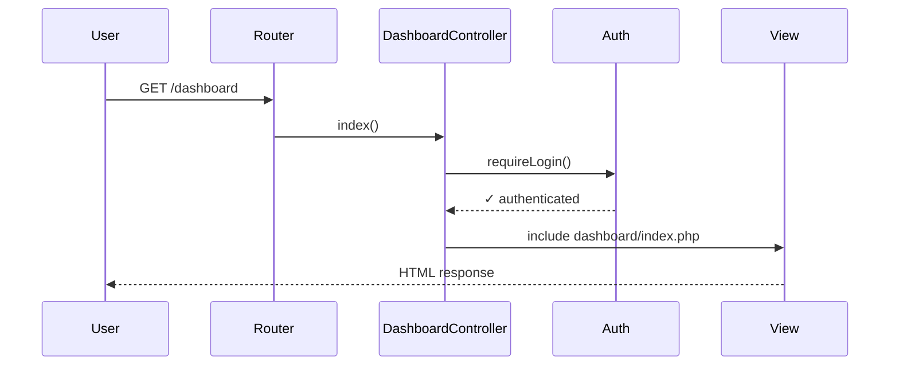

Apartado de Salas implements a clean MVC (Model-View-Controller) architecture that separates business logic, data access, and presentation layers. This pattern provides maintainability, testability, and clear separation of concerns.

## MVC Overview

The MVC pattern divides the application into three interconnected components:



<Info>
**Controller** receives requests, **Model** handles data, and **View** renders responses. Controllers never directly manipulate data, and views never contain business logic.
</Info>

## Directory Structure

```
app/
├── controllers/
│   ├── AuthController.php
│   ├── DashboardController.php
│   ├── ReservationController.php
│   └── MaterialController.php
├── models/
│   ├── user.php
│   ├── Reservation.php
│   ├── Room.php
│   ├── Material.php
│   └── ReservationSlot.php
└── views/
    ├── auth/
    │   └── login.php
    ├── dashboard/
    │   └── index.php
    └── reservations/
        ├── create.php
        ├── index.php
        ├── mine.php
        └── show.php
```

## Controllers

Controllers handle HTTP requests and orchestrate the flow between models and views. They contain no business logic or database queries.

### Controller Anatomy

Here's a typical controller structure:

```php app/controllers/DashboardController.php
<?php   

require_once dirname(__DIR__) . '/Helpers/Session.php';
require_once dirname(__DIR__) . '/Helpers/Auth.php';

class DashboardController
{
     public function index(): void
    {
        Auth::requireLogin();

        require_once dirname(__DIR__) . '/views/dashboard/index.php';
    }
}
```

<Note>
Controllers use the `Auth` helper to enforce authentication before rendering views. The `requireLogin()` method redirects unauthenticated users to the login page.
</Note>

### Controller Responsibilities

Controllers are responsible for:

1. **Authentication/Authorization** - Verify user access
2. **Request Validation** - Validate input data
3. **Model Interaction** - Call model methods to retrieve/manipulate data
4. **View Rendering** - Load the appropriate view template
5. **Response Handling** - Set HTTP headers and redirects

### Authentication Controller Example

The `AuthController` demonstrates a complete request handling flow:

```php app/controllers/AuthController.php
<?php

require_once dirname(__DIR__) . '/models/user.php';
require_once dirname(__DIR__) . '/Helpers/Session.php';

class AuthController
{
    public function showLogin(): void {
        if (Session::isActive()) {
            header('Location: ' . BASE_URL . '/dashboard');
            exit;
        }

        require_once dirname(__DIR__) . '/views/auth/login.php';
    }

    public function login(): void
    {
        if ($_SERVER['REQUEST_METHOD'] !== 'POST') {
            header('Location: ' . BASE_URL . '/login');
            exit;
        }

        $user = $_POST['username'] ?? '';
        $pass = $_POST['password'] ?? '';

        if (empty($user) || empty($pass)) {
            Session::setFlash('error', 'Todos los campos son obligatorios.');
            header('Location: login');
            exit;
        }

        $userModel = new User();
        $authResult = $userModel->authenticate($user, $pass);

        if (!$authResult) {
            Session::setFlash('error', 'Usuario o contraseña incorrectos.');
            session_write_close();
            
            header('Location: ' . BASE_URL . '/login');
            exit;
        }

        Session::create($authResult);

        header('Location: ' .BASE_URL . '/dashboard');
        exit;
    }

    public function logout(): void
    {
        if (session_status() === PHP_SESSION_NONE){
            session_start();
        }

        session_unset();
        session_destroy();
        session_regenerate_id(true);

        header('Location: ' . BASE_URL . '/login');
        exit;
    }
}
```

### Key Controller Patterns

<Tabs>
  <Tab title="Input Validation">
    Controllers validate user input before passing to models:
    
    ```php
    $user = $_POST['username'] ?? '';
    $pass = $_POST['password'] ?? '';
    
    if (empty($user) || empty($pass)) {
        Session::setFlash('error', 'Todos los campos son obligatorios.');
        header('Location: login');
        exit;
    }
    ```
  </Tab>
  
  <Tab title="Flash Messages">
    Controllers set flash messages for user feedback:
    
    ```php
    Session::setFlash('error', 'Usuario o contraseña incorrectos.');
    ```
    
    Flash messages are displayed once and automatically cleared.
  </Tab>
  
  <Tab title="Redirects">
    Controllers use HTTP redirects for flow control:
    
    ```php
    header('Location: ' . BASE_URL . '/dashboard');
    exit;
    ```
    
    Always call `exit` after `header()` to prevent further execution.
  </Tab>
</Tabs>

## Models

Models encapsulate all database operations and business logic. They use the `Database` class to obtain PDO connections and execute queries.

### Model Structure

Models follow a consistent pattern:

```php app/models/user.php
<?php

require_once dirname(__DIR__) . '/core/Database.php';

class User
{
    /**
     * Authenticate a user by username and password
     */
    public function authenticate(string $username, string $password)
    {
        $db = Database::getConnection();

        $sql = "
            SELECT id, username, email, password, role
            FROM users
            WHERE username = :username
            LIMIT 1
        ";

        $stmt = $db->prepare($sql);
        $stmt->bindParam(':username', $username, PDO::PARAM_STR);
        $stmt->execute();

        $user = $stmt->fetch();

        if (!$user) {
            return false;
        }

        if (!password_verify($password, $user['password'])) {
            return false;
        }

        // Never return the password
        unset($user['password']);

        return $user;
    }
}
```

### Model Best Practices

<Note>
**Security:** Models always use prepared statements with parameter binding to prevent SQL injection.

**Privacy:** Sensitive data (like passwords) is never returned from model methods.

**Return Types:** Models return arrays, objects, or `false`/`null` on failure.
</Note>

### Complex Model Example

The `Reservation` model demonstrates CRUD operations and relationships:

```php app/models/Reservation.php
<?php

require_once dirname(__DIR__) . '/core/Database.php';

class Reservation
{
    private \PDO $db;

    public function __construct()
    {
        $this->db = Database::getConnection();
    }

    /**
     * Create a new reservation
     */
    public function create(
        int $userId,
        int $roomId,
        string $eventName,
        ?string $notes = null
    ): int {
        $sql = "
            INSERT INTO reservations (user_id, room_id, event_name, notes)
            VALUES (:user_id, :room_id, :event_name, :notes)
        ";

        $stmt = $this->db->prepare($sql);
        $stmt->bindParam(':user_id', $userId, PDO::PARAM_INT);
        $stmt->bindParam(':room_id', $roomId, PDO::PARAM_INT);
        $stmt->bindParam(':event_name', $eventName);
        $stmt->bindParam(':notes', $notes);

        $stmt->execute();

        return (int) $this->db->lastInsertId();
    }

    /**
     * Get a reservation by ID with joined data
     */
    public function findById(int $id): ?array
    {
        $sql = "
            SELECT 
                r.id,
                r.user_id,
                r.room_id,
                r.event_name,
                r.status,
                r.notes,
                r.created_at,
                u.username,
                rm.name AS room_name
            FROM reservations r
            JOIN users u ON u.id = r.user_id
            JOIN rooms rm ON rm.id = r.room_id
            WHERE r.id = :id
            LIMIT 1
        ";

        $stmt = $this->db->prepare($sql);
        $stmt->bindParam(':id', $id, PDO::PARAM_INT);
        $stmt->execute();

        $reservation = $stmt->fetch(PDO::FETCH_ASSOC);

        return $reservation ?: null;
    }

    /**
     * Update reservation status
     */
    public function updateStatus(int $reservationId, string $status): bool
    {
        $allowedStatuses = ['pendiente', 'aprobado', 'rechazado'];

        if (!in_array($status, $allowedStatuses, true)) {
            throw new InvalidArgumentException('Estado de reservación inválido');
        }

        $sql = "
            UPDATE reservations
            SET status = :status
            WHERE id = :id
        ";

        $stmt = $this->db->prepare($sql);
        $stmt->bindParam(':status', $status);
        $stmt->bindParam(':id', $reservationId, PDO::PARAM_INT);

        return $stmt->execute();
    }
}
```

### Model Patterns

<Tabs>
  <Tab title="Constructor Injection">
    Models store the PDO connection in a private property:
    
    ```php
    private \PDO $db;
    
    public function __construct()
    {
        $this->db = Database::getConnection();
    }
    ```
  </Tab>
  
  <Tab title="Parameter Binding">
    All queries use parameterized statements:
    
    ```php
    $stmt = $this->db->prepare($sql);
    $stmt->bindParam(':id', $id, PDO::PARAM_INT);
    $stmt->execute();
    ```
  </Tab>
  
  <Tab title="Input Validation">
    Models validate input before database operations:
    
    ```php
    $allowedStatuses = ['pendiente', 'aprobado', 'rechazado'];
    
    if (!in_array($status, $allowedStatuses, true)) {
        throw new InvalidArgumentException('Estado inválido');
    }
    ```
  </Tab>
  
  <Tab title="Relationships">
    Models use SQL JOINs to fetch related data:
    
    ```php
    SELECT 
        r.*,
        u.username,
        rm.name AS room_name
    FROM reservations r
    JOIN users u ON u.id = r.user_id
    JOIN rooms rm ON rm.id = r.room_id
    ```
  </Tab>
</Tabs>

## Views

Views are PHP templates that render HTML. They receive data from controllers and display it to users.

### View Characteristics

- **No Business Logic** - Views only contain presentation logic
- **PHP Templates** - Mix PHP and HTML for dynamic rendering
- **Data Display** - Receive data through included variables
- **Reusable Components** - Can include partials/layouts

### View Example

```php app/views/dashboard/index.php
<!DOCTYPE html>
<html lang="es">
<head>
    <meta charset="UTF-8">
    <title>Dashboard - Apartado de Salas</title>
</head>
<body>
    <h1>Bienvenido, <?= htmlspecialchars($_SESSION['user']['username']) ?></h1>
    
    <nav>
        <a href="<?= BASE_URL ?>/reservations/create">Nueva Reservación</a>
        <a href="<?= BASE_URL ?>/reservations/mine">Mis Reservaciones</a>
        <a href="<?= BASE_URL ?>/logout">Cerrar Sesión</a>
    </nav>
</body>
</html>
```

<Note>
Views always use `htmlspecialchars()` when outputting user data to prevent XSS attacks.
</Note>

## MVC Flow Example

Here's a complete request flow for viewing the dashboard:



## Benefits of MVC

The MVC pattern provides several advantages:

1. **Separation of Concerns** - Each component has a single responsibility
2. **Maintainability** - Changes to one layer don't affect others
3. **Testability** - Models can be tested independently
4. **Reusability** - Models can be used by multiple controllers
5. **Collaboration** - Different developers can work on different layers

## Next Steps

- [Routing System](/architecture/routing) - Learn how requests are routed to controllers
- [Database Layer](/architecture/database) - Understand the PDO connection management