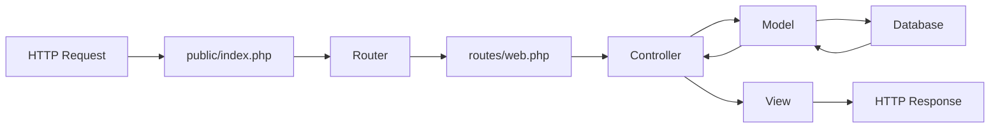

Apartado de Salas is a custom PHP application built with a clean MVC architecture and a lightweight custom router. The application follows modern PHP practices while maintaining simplicity and avoiding heavy framework dependencies.

## Architecture Principles

The system is designed around three core principles:

1. **Separation of Concerns** - MVC pattern separates business logic, data access, and presentation
2. **Custom Routing** - Lightweight router without framework overhead
3. **Database Abstraction** - PDO-based database layer for secure, prepared statements

## Directory Structure

```
Apartado-Salas/
├── app/
│   ├── config/          # Configuration files
│   ├── controllers/     # Controller classes
│   ├── core/           # Core classes (Router, Database)
│   ├── Helpers/        # Helper classes (Session, Auth)
│   ├── models/         # Model classes (data layer)
│   └── views/          # View templates (presentation)
├── public/
│   └── index.php       # Front controller (entry point)
├── routes/
│   └── web.php         # Route definitions
└── database/           # Database migrations and seeds
```

<Note>
The `public/` directory is the only web-accessible folder. All application code is kept outside the web root for security.
</Note>

## Request Flow

The application follows a front controller pattern with the following request lifecycle:



### Request Lifecycle Steps

1. **Entry Point** - All requests are routed to `public/index.php`
2. **Router Initialization** - Router instance is created and route definitions are loaded
3. **Route Matching** - Router matches the request URI and HTTP method to registered routes
4. **Controller Dispatch** - Matched controller and action method are invoked
5. **Business Logic** - Controller interacts with models to retrieve/manipulate data
6. **View Rendering** - Controller loads the appropriate view template
7. **Response** - HTML is returned to the client

## Front Controller

The `public/index.php` file serves as the single entry point for all HTTP requests:

```php public/index.php
<?php

// Display errors (development only)
ini_set('display_errors', 1);
error_reporting(E_ALL);

require_once __DIR__ . '/../app/config/app.php';
require_once __DIR__ . '/../app/Helpers/Session.php';
require_once __DIR__ . '/../app/core/Router.php';

// Create Router instance
$router = new Router();

// Load route definitions
require_once __DIR__ . '/../routes/web.php';

// Execute the router
$router->dispatch();
```

<Info>
The front controller pattern ensures that all requests go through a single point, allowing for centralized request handling, security checks, and initialization logic.
</Info>

## Core Components

The application's core functionality is provided by two main classes:

<Tabs>
  <Tab title="Router">
    **Router** (`app/core/Router.php`)
    
    Custom routing system that maps HTTP requests to controller actions. Features:
    - HTTP method matching (GET, POST)
    - Clean URL support
    - Base path normalization for subdirectory installations
    - Controller/action dispatching
    - 404 error handling
    
    [Learn more →](/architecture/routing)
  </Tab>
  
  <Tab title="Database">
    **Database** (`app/core/Database.php`)
    
    PDO connection manager using the Singleton pattern. Features:
    - Single database connection per request
    - Prepared statements for SQL injection protection
    - Exception-based error handling
    - Associative array fetch mode
    
    [Learn more →](/architecture/database)
  </Tab>
</Tabs>

## MVC Components

### Controllers

Controllers handle HTTP requests and coordinate between models and views:

- `AuthController` - Authentication (login/logout)
- `DashboardController` - Dashboard views
- `ReservationController` - Reservation management
- `MaterialController` - Material API endpoints

### Models

Models encapsulate database operations and business logic:

- `User` - User authentication and management
- `Reservation` - Reservation CRUD operations
- `Room` - Room data management
- `Material` - Material management
- `ReservationSlot` - Time slot management

### Views

Views are PHP templates that render HTML responses:

```
app/views/
├── auth/
│   └── login.php
├── dashboard/
│   └── index.php
└── reservations/
    ├── create.php
    ├── index.php
    ├── mine.php
    └── show.php
```

## Helper Classes

The application includes helper classes for common functionality:

- **Session** - Session management and flash messages
- **Auth** - Authentication guards and role checks

## Security Features

<Note>
The application implements several security best practices:
- Prepared statements prevent SQL injection
- Password hashing with `password_verify()`
- Session management with secure regeneration
- Authentication guards on protected routes
- CSRF protection (recommended for future enhancement)
</Note>

## Next Steps

Explore the detailed documentation for each architectural component:

- [MVC Pattern](/architecture/mvc-pattern) - Detailed MVC implementation
- [Routing System](/architecture/routing) - Custom router deep dive
- [Database Layer](/architecture/database) - PDO connection and models