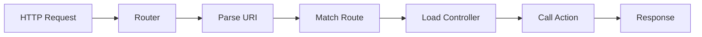

Apartado de Salas uses a custom-built router that provides clean URL routing without the overhead of a full framework. The router handles HTTP method matching, path normalization, and controller dispatching.

## Router Architecture

The router is a simple PHP class located at `app/core/Router.php` that manages route registration and request dispatching.



## Router Class

Here's the complete router implementation:

```php app/core/Router.php
<?php

class Router
{
    private array $routes = [];
   
    // Register routes
    public function add(string $method, string $path, string $controller, string $action): void
    {
        $this->routes[] = [
            'method'     => strtoupper($method),
            'path'       => $path,
            'controller' => $controller,
            'action'     => $action
        ];
    }

    // Get current request path
    private function getCurrentPath(): string
    {
        $uri = parse_url($_SERVER['REQUEST_URI'], PHP_URL_PATH);

        // Current script path (e.g., /dashboard/Portafolio/Apartado-Salas/public/index.php)
        $scriptName = $_SERVER['SCRIPT_NAME'];

        // Base directory (e.g., /dashboard/Portafolio/Apartado-Salas/public)
        $basePath = rtrim(str_replace('/index.php', '', $scriptName), '/');

        // Remove base path from URI
        if (strpos($uri, $basePath) === 0) {
            $uri = substr($uri, strlen($basePath));
        }

        // Normalize the final path
        $uri = '/' . trim($uri, '/');

        return $uri === '/' ? '/' : $uri;
    }

    // Get HTTP request method
    private function getRequestMethod(): string
    {
        return $_SERVER['REQUEST_METHOD'];
    }

    // Dispatch the request to the appropriate controller
    public function dispatch(): void
    {
        $currentPath   = $this->getCurrentPath();
        $requestMethod = $this->getRequestMethod();

        foreach ($this->routes as $route) {
            if (
                $route['path'] === $currentPath &&
                $route['method'] === $requestMethod
            ) {
                $this->callAction($route['controller'], $route['action']);
                return;
            }
        }

        $this->handleNotFound();
    }

    private function callAction(string $controllerName, string $action): void
    {
        $controllerFile = __DIR__ . '/../controllers/' . $controllerName . '.php';

        if (!file_exists($controllerFile)) {
            die('Controlador no encontrado');
        }

        require_once $controllerFile;

        $controller = new $controllerName();

        if (!method_exists($controller, $action)) {
            die('Método no encontrado en el controlador');
        }

        $controller->$action();
    }

    // Handle 404 errors
    private function handleNotFound(): void
    {
        http_response_code(404);
        echo '404 - Página no encontrada';
    }
}
```

## Route Registration

Routes are registered in `routes/web.php` using the `add()` method:

```php routes/web.php
<?php

// Authentication routes
$router->add('GET', '/login', 'AuthController', 'showLogin');
$router->add('POST', '/login', 'AuthController', 'login');
$router->add('GET', '/logout', 'AuthController', 'logout');

// Root route
$router->add('GET', '/', 'AuthController', 'showLogin');

// Dashboard
$router->add('GET', '/dashboard', 'DashboardController', 'index');

// Reservations
$router->add('GET',  '/reservations/create', 'ReservationController', 'create');
$router->add('POST', '/reservations/store',  'ReservationController', 'store');
$router->add('GET', '/reservations', 'ReservationController', 'index');
$router->add('POST', '/reservations/approve', 'ReservationController', 'approve');
$router->add('POST', '/reservations/reject', 'ReservationController', 'reject');
$router->add('GET', '/reservations/show', 'ReservationController', 'show');
$router->add('GET', '/reservations/mine', 'ReservationController', 'mine');

// Internal API
$router->add('GET', '/api/materials', 'MaterialController', 'byRoom');
```

### Route Definition Format

The `add()` method accepts four parameters:

```php
$router->add(
    'GET',                    // HTTP method
    '/reservations/create',   // URI path
    'ReservationController',  // Controller class name
    'create'                  // Action method name
);
```

<Info>
HTTP methods are automatically converted to uppercase for consistent matching. Both `'get'` and `'GET'` work identically.
</Info>

## Path Normalization

The router intelligently handles different installation paths, making it work in both root and subdirectory environments.

### Base Path Detection

The `getCurrentPath()` method automatically detects the application's base path:

```php
// Example: App installed at /dashboard/Portafolio/Apartado-Salas/public/
$scriptName = $_SERVER['SCRIPT_NAME'];
// Result: /dashboard/Portafolio/Apartado-Salas/public/index.php

$basePath = rtrim(str_replace('/index.php', '', $scriptName), '/');
// Result: /dashboard/Portafolio/Apartado-Salas/public
```

### URI Cleaning

The router strips the base path from incoming requests:

```php
// Request: /dashboard/Portafolio/Apartado-Salas/public/login
// Base path: /dashboard/Portafolio/Apartado-Salas/public
// Clean path: /login

if (strpos($uri, $basePath) === 0) {
    $uri = substr($uri, strlen($basePath));
}
```

<Tabs>
  <Tab title="Root Installation">
    When installed at domain root:
    
    ```
    Request: https://example.com/login
    Script:  /public/index.php
    Base:    /public
    Path:    /login ✓
    ```
  </Tab>
  
  <Tab title="Subdirectory Installation">
    When installed in a subdirectory:
    
    ```
    Request: https://example.com/app/public/login
    Script:  /app/public/index.php
    Base:    /app/public
    Path:    /login ✓
    ```
  </Tab>
</Tabs>

## Request Dispatching

The `dispatch()` method is called from `public/index.php` to handle incoming requests:

```php public/index.php
$router = new Router();
require_once __DIR__ . '/../routes/web.php';
$router->dispatch();
```

### Dispatch Process

1. **Extract Request Details**
   ```php
   $currentPath   = $this->getCurrentPath();   // e.g., /login
   $requestMethod = $this->getRequestMethod(); // e.g., POST
   ```

2. **Match Against Registered Routes**
   ```php
   foreach ($this->routes as $route) {
       if (
           $route['path'] === $currentPath &&
           $route['method'] === $requestMethod
       ) {
           $this->callAction($route['controller'], $route['action']);
           return;
       }
   }
   ```

3. **Call Controller Action or Return 404**
   ```php
   $this->handleNotFound();
   ```

## Controller Loading

The `callAction()` method dynamically loads and instantiates controllers:

```php
private function callAction(string $controllerName, string $action): void
{
    // Build controller file path
    $controllerFile = __DIR__ . '/../controllers/' . $controllerName . '.php';

    // Check if controller file exists
    if (!file_exists($controllerFile)) {
        die('Controlador no encontrado');
    }

    // Load the controller file
    require_once $controllerFile;

    // Instantiate the controller
    $controller = new $controllerName();

    // Check if action method exists
    if (!method_exists($controller, $action)) {
        die('Método no encontrado en el controlador');
    }

    // Call the action method
    $controller->$action();
}
```

<Note>
The router uses dynamic method invocation to call controller actions. This allows for flexible routing without hardcoded controller references.
</Note>

## Error Handling

The router includes basic error handling for common scenarios:

### 404 Not Found

When no route matches the request:

```php
private function handleNotFound(): void
{
    http_response_code(404);
    echo '404 - Página no encontrada';
}
```

### Controller Not Found

When the controller file doesn't exist:

```php
if (!file_exists($controllerFile)) {
    die('Controlador no encontrado');
}
```

### Action Not Found

When the controller exists but the action method doesn't:

```php
if (!method_exists($controller, $action)) {
    die('Método no encontrado en el controlador');
}
```

## HTTP Method Support

The router currently supports standard HTTP methods:

<Tabs>
  <Tab title="GET">
    Used for retrieving data and displaying pages:
    
    ```php
    $router->add('GET', '/dashboard', 'DashboardController', 'index');
    $router->add('GET', '/reservations', 'ReservationController', 'index');
    ```
  </Tab>
  
  <Tab title="POST">
    Used for form submissions and data modifications:
    
    ```php
    $router->add('POST', '/login', 'AuthController', 'login');
    $router->add('POST', '/reservations/store', 'ReservationController', 'store');
    $router->add('POST', '/reservations/approve', 'ReservationController', 'approve');
    ```
  </Tab>
</Tabs>

<Info>
The router can be easily extended to support PUT, PATCH, and DELETE methods by adding them to the route matching logic.
</Info>

## Route Organization

Routes are organized by functionality in `routes/web.php`:

```php
// Authentication
$router->add('GET', '/login', 'AuthController', 'showLogin');
$router->add('POST', '/login', 'AuthController', 'login');
$router->add('GET', '/logout', 'AuthController', 'logout');

// Dashboard
$router->add('GET', '/dashboard', 'DashboardController', 'index');

// Reservations - Create
$router->add('GET',  '/reservations/create', 'ReservationController', 'create');
$router->add('POST', '/reservations/store',  'ReservationController', 'store');

// Reservations - List
$router->add('GET', '/reservations', 'ReservationController', 'index');
$router->add('GET', '/reservations/mine', 'ReservationController', 'mine');

// Reservations - Actions
$router->add('POST', '/reservations/approve', 'ReservationController', 'approve');
$router->add('POST', '/reservations/reject', 'ReservationController', 'reject');
```

## Advantages of Custom Router

The custom router provides several benefits:

1. **Lightweight** - No framework overhead or dependencies
2. **Flexible Installation** - Works in root or subdirectories
3. **Simple to Understand** - Clean, readable code
4. **Easy to Extend** - Add features as needed
5. **Full Control** - Complete control over routing logic

## Limitations

The current implementation has some limitations:

- **No Route Parameters** - Cannot extract variables from URLs (e.g., `/users/{id}`)
- **No Named Routes** - Routes are referenced by path strings
- **No Route Groups** - No middleware or prefix support
- **Basic Error Handling** - Simple error messages instead of custom error pages

<Note>
These limitations are acceptable for the current application scope but could be addressed with future enhancements.
</Note>

## Future Enhancements

Potential improvements to the routing system:

```php
// Route parameters
$router->add('GET', '/users/{id}', 'UserController', 'show');

// Named routes
$router->add('GET', '/dashboard', 'DashboardController', 'index', 'dashboard');

// Middleware
$router->add('GET', '/admin', 'AdminController', 'index')
       ->middleware('auth', 'admin');

// Route groups
$router->group(['prefix' => 'api', 'middleware' => 'api'], function($router) {
    $router->add('GET', '/materials', 'MaterialController', 'index');
});
```

## Next Steps

- [MVC Pattern](/architecture/mvc-pattern) - Learn how controllers handle routed requests
- [Database Layer](/architecture/database) - Understand data persistence