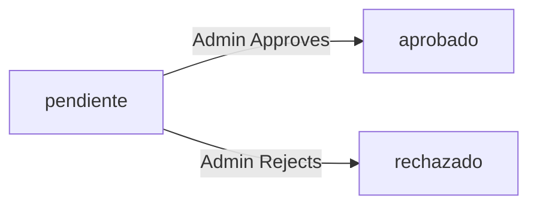

The reservation system is the core feature of Apartado de Salas, enabling users to book rooms for events across multiple time slots with material assignment and administrative approval.

## Reservation Architecture

Reservations in Apartado de Salas consist of three key components:

1. **Reservation (Expediente)**: The main reservation record containing event details and status
2. **Reservation Slots**: Multiple time blocks associated with a single reservation
3. **Material Assignments**: Materials requested for the reservation

<Info>
  A single reservation can span multiple dates and time slots, all managed as one approval unit.
</Info>

## Creating a Reservation

The reservation creation process involves multiple validation steps and database operations:

<Steps>
  <Step title="User authentication">
    Only authenticated users can create reservations.
    
    ```php
    // From app/controllers/ReservationController.php:17
    Auth::requireLogin();
    ```
  </Step>
  
  <Step title="Form submission">
    Users submit reservation details including:
    - Room ID
    - Event name
    - Optional notes
    - Multiple date/time slots (arrays)
    - Material IDs (array)
  </Step>
  
  <Step title="Validation">
    The system validates that all required fields are present.
    
    ```php
    // From app/controllers/ReservationController.php:46-51
    if (!$userId || !$roomId || empty($event)) {
        Session::setFlash('error', 'Datos incompletos.');
        header('Location: '. BASE_URL . '/reservations/create');
        exit;
    }
    ```
  </Step>
  
  <Step title="Transaction begins">
    A database transaction ensures data consistency.
    
    ```php
    // From app/controllers/ReservationController.php:66-67
    $db = Database::getConnection();
    $db->beginTransaction();
    ```
  </Step>
  
  <Step title="Create reservation record">
    The main reservation (expediente) is created.
    
    ```php
    // From app/models/Reservation.php:17-38
    public function create(
        int $userId,
        int $roomId,
        string $eventName,
        ?string $notes = null
    ): int {
        $sql = "INSERT INTO reservations 
                (user_id, room_id, event_name, notes)
                VALUES (:user_id, :room_id, :event_name, :notes)";
        
        $stmt->execute();
        return (int) $this->db->lastInsertId();
    }
    ```
  </Step>
  
  <Step title="Validate and create time slots">
    Each time slot is validated for conflicts before creation.
    
    ```php
    // From app/controllers/ReservationController.php:78-91
    foreach ($dates as $index => $date) {
        if ($slotModel->hasConflict((int)$roomId, $date, $start, $end)) {
            throw new Exception("Conflicto de horario el $date de $start a $end.");
        }
        
        $slotModel->create($reservationId, $date, $start, $end);
    }
    ```
  </Step>
  
  <Step title="Assign materials">
    Materials are validated and attached to the reservation.
    
    ```php
    // From app/controllers/ReservationController.php:94-98
    if (!$materialModel->validateForRoom($materials, (int)$roomId)) {
        throw new Exception('Materiales no válidos para la sala.');
    }
    
    $reservationModel->attachMaterials($reservationId, $materials);
    ```
  </Step>
  
  <Step title="Commit transaction">
    If all operations succeed, the transaction is committed.
    
    ```php
    // From app/controllers/ReservationController.php:102-106
    $db->commit();
    Session::setFlash('success', 'La reservación fue creada correctamente.');
    header('Location:'. BASE_URL.'/dashboard');
    ```
  </Step>
</Steps>

<Warning>
  If any step fails, the entire transaction is rolled back to maintain data consistency:
  
  ```php
  // From app/controllers/ReservationController.php:108-117
  catch (Exception $e) {
      if(isset($db) && $db->inTransaction()) {
          $db->rollBack();
      }
      Session::setFlash('error', $e->getMessage());
  }
  ```
</Warning>

## Multi-Slot Booking

One of the key features is the ability to book multiple time slots in a single reservation.

### Time Slot Structure

```php
// From app/models/ReservationSlot.php:17-35
public function create(
    int $reservationId,
    string $date,
    string $startTime,
    string $endTime
): bool {
    $sql = "INSERT INTO reservation_slots 
            (reservation_id, date, start_time, end_time)
            VALUES (:reservation_id, :date, :start_time, :end_time)";
    
    return $stmt->execute();
}
```

### Conflict Detection

The system prevents double-booking by detecting time slot conflicts:

<Accordion title="Conflict Detection Algorithm">
  ```php
  // From app/models/ReservationSlot.php:59-85
  public function hasConflict(
      int $roomId,
      string $date,
      string $startTime,
      string $endTime
  ): bool {
      $sql = "SELECT 1
              FROM reservation_slots rs
              JOIN reservations r ON r.id = rs.reservation_id
              WHERE r.room_id = :room_id
                AND rs.date = :date
                AND (rs.start_time < :end_time 
                     AND rs.end_time > :start_time)
              LIMIT 1";
      
      return (bool) $stmt->fetchColumn();
  }
  ```
  
  **Logic:** A conflict exists if:
  - Same room
  - Same date
  - Time ranges overlap: `(existing_start < new_end) AND (existing_end > new_start)`
</Accordion>

### Retrieving Slots

<Tabs>
  <Tab title="By Reservation">
    ```php
    // From app/models/ReservationSlot.php:40-54
    public function getByReservation(int $reservationId): array
    {
        $sql = "SELECT date, start_time, end_time
                FROM reservation_slots
                WHERE reservation_id = :reservation_id
                ORDER BY date, start_time";
        
        return $stmt->fetchAll(PDO::FETCH_ASSOC);
    }
    ```
  </Tab>
  
  <Tab title="Occupied Slots">
    ```php
    // From app/models/ReservationSlot.php:91-108
    public function getOccupiedSlots(int $roomId, string $date): array
    {
        $sql = "SELECT rs.start_time, rs.end_time
                FROM reservation_slots rs
                JOIN reservations r ON r.id = rs.reservation_id
                WHERE r.room_id = :room_id
                  AND rs.date = :date
                ORDER BY rs.start_time";
        
        return $stmt->fetchAll(PDO::FETCH_ASSOC);
    }
    ```
    
    This method is useful for displaying availability calendars.
  </Tab>
</Tabs>

## Reservation Status Workflow

Reservations follow a three-state approval workflow:



### Status Management

```php
// From app/models/Reservation.php:101-120
public function updateStatus(int $reservationId, string $status): bool
{
    $allowedStatuses = ['pendiente', 'aprobado', 'rechazado'];
    
    if (!in_array($status, $allowedStatuses, true)) {
        throw new InvalidArgumentException('Estado inválido');
    }
    
    $sql = "UPDATE reservations
            SET status = :status
            WHERE id = :id";
    
    return $stmt->execute();
}
```

### Admin Approval Actions

<Tabs>
  <Tab title="Approve">
    ```php
    // From app/controllers/ReservationController.php:176-204
    public function approve(): void {
        Auth::requireRole('admin'); // Admin only
        
        $id = $_POST['id'] ?? null;
        
        $reservationModel = new Reservation();
        $reservationModel->updateStatus((int)$id, 'aprobado');
        
        Session::setFlash('success', 'Solicitud aprobada correctamente.');
        header('Location: ' . BASE_URL . '/reservations');
    }
    ```
  </Tab>
  
  <Tab title="Reject">
    ```php
    // From app/controllers/ReservationController.php:208-238
    public function reject(): void
    {
        Auth::requireRole('admin'); // Admin only
        
        $id = $_POST['id'] ?? null;
        
        $reservationModel = new Reservation();
        $reservationModel->updateStatus((int)$id, 'rechazado');
        
        Session::setFlash('success', 'Solicitud rechazada.');
        header('Location: ' . BASE_URL . '/reservations');
    }
    ```
  </Tab>
</Tabs>

<Note>
  Only users with the `admin` role can approve or reject reservations. The `Auth::requireRole('admin')` check enforces this at the controller level.
</Note>

## Querying Reservations

The system provides multiple methods to retrieve reservations:

<Accordion title="Get All Reservations">
  ```php
  // From app/models/Reservation.php:76-96
  public function getAll(): array
  {
      $sql = "SELECT 
                  r.id, r.event_name, r.status, r.created_at,
                  rm.name AS room_name,
                  u.username
              FROM reservations r
              JOIN rooms rm ON rm.id = r.room_id
              JOIN users u ON u.id = r.user_id
              ORDER BY r.created_at DESC";
      
      return $stmt->fetchAll(PDO::FETCH_ASSOC);
  }
  ```
  
  Used by admins to view all reservations in the system.
</Accordion>

<Accordion title="Get by Status">
  ```php
  // From app/models/Reservation.php:179-207
  public function getByStatus(string $status): array
  {
      $allowedStatuses = ['pendiente', 'aprobado', 'rechazado'];
      
      if (!in_array($status, $allowedStatuses, true)) {
          return [];
      }
      
      $sql = "SELECT /* ... */ 
              WHERE r.status = :status
              ORDER BY r.created_at DESC";
      
      return $stmt->fetchAll(PDO::FETCH_ASSOC);
  }
  ```
  
  **Usage:**
  ```php
  // From app/controllers/ReservationController.php:130-136
  $status = $_GET['status'] ?? null;
  if ($status) {
      $reservations = $reservationModel->getByStatus($status);
  }
  ```
</Accordion>

<Accordion title="Get by User">
  ```php
  // From app/models/Reservation.php:212-231
  public function getByUser(int $userId): array
  {
      $sql = "SELECT
                  r.id, r.event_name, r.status, r.created_at,
                  rm.name AS room_name
              FROM reservations r
              JOIN rooms rm ON rm.id = r.room_id
              WHERE r.user_id = :user_id
              ORDER BY r.created_at DESC";
      
      return $stmt->fetchAll(PDO::FETCH_ASSOC);
  }
  ```
  
  Used in the user dashboard to show personal reservations.
</Accordion>

<Accordion title="Find by ID">
  ```php
  // From app/models/Reservation.php:43-70
  public function findById(int $id): ?array
  {
      $sql = "SELECT 
                  r.id, r.user_id, r.room_id, r.event_name,
                  r.status, r.notes, r.created_at,
                  u.username,
                  rm.name AS room_name
              FROM reservations r
              JOIN users u ON u.id = r.user_id
              JOIN rooms rm ON rm.id = r.room_id
              WHERE r.id = :id
              LIMIT 1";
      
      return $reservation ?: null;
  }
  ```
</Accordion>

## Viewing Reservation Details

Admins can view complete reservation details including slots and materials:

```php
// From app/controllers/ReservationController.php:264-288
public function show(): void {
    Auth::requireRole('admin');
    
    $id = $_GET['id'] ?? null;
    
    $reservationModel = new Reservation();
    
    $reservation = $reservationModel->findById((int)$id);
    $slots = $reservationModel->getSlots((int)$id);
    $materials = $reservationModel->getMaterials((int)$id);
    
    if (!$reservation) {
        Session::setFlash('error', 'Solicitud no encontrada.');
        header('Location: ' . BASE_URL . '/reservations');
        exit;
    }
    
    // Render view with $reservation, $slots, $materials
}
```

### Getting Slots and Materials

<Tabs>
  <Tab title="Get Slots">
    ```php
    // From app/models/Reservation.php:236-249
    public function getSlots(int $reservationId): array
    {
        $sql = "SELECT date, start_time, end_time
                FROM reservation_slots
                WHERE reservation_id = :id
                ORDER BY date, start_time";
        
        return $stmt->fetchAll(PDO::FETCH_ASSOC);
    }
    ```
  </Tab>
  
  <Tab title="Get Materials">
    ```php
    // From app/models/Reservation.php:159-174
    public function getMaterials(int $reservationId): array
    {
        $sql = "SELECT m.id, m.name
                FROM reservation_materials rm
                JOIN materials m ON m.id = rm.material_id
                WHERE rm.reservation_id = :reservation_id
                ORDER BY m.name";
        
        return $stmt->fetchAll(PDO::FETCH_ASSOC);
    }
    ```
  </Tab>
</Tabs>

## User Dashboard Access

Users can view their own reservations through the `mine()` controller action:

```php
// From app/controllers/ReservationController.php:243-259
public function mine(): void {
    Auth::requireLogin();
    
    $userId = $_SESSION['user']['id'] ?? null;
    
    $reservationModel = new Reservation();
    $reservations = $reservationModel->getByUser($userId);
    
    require_once dirname(__DIR__) . '/views/reservations/mine.php';
}
```

<Info>
  Users can only see their own reservations, while admins can see all reservations through the `index()` action.
</Info>

## Reservation Data Structure

A complete reservation includes:

```php
[
    // Main reservation
    'id' => 1,
    'user_id' => 5,
    'room_id' => 2,
    'event_name' => 'Workshop de React',
    'status' => 'pendiente', // or 'aprobado', 'rechazado'
    'notes' => 'Necesitamos sillas adicionales',
    'created_at' => '2026-03-04 10:30:00',
    'username' => 'john_doe',
    'room_name' => 'Sala de Conferencias',
    
    // Time slots (separate query)
    'slots' => [
        ['date' => '2026-03-10', 'start_time' => '09:00', 'end_time' => '12:00'],
        ['date' => '2026-03-11', 'start_time' => '14:00', 'end_time' => '17:00']
    ],
    
    // Materials (separate query)
    'materials' => [
        ['id' => 1, 'name' => 'Proyector'],
        ['id' => 3, 'name' => 'Micrófono']
    ]
]
```