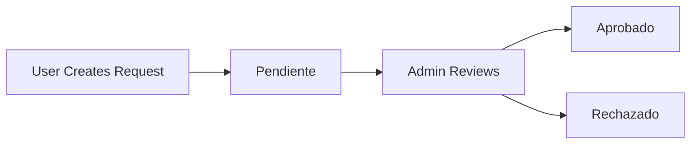

## Overview

As an administrator in Apartado de Salas, you have full access to manage room reservation requests, approve or reject submissions, and oversee the entire reservation system. This guide covers all administrative capabilities and workflows.

## Administrator Capabilities

Administrators have access to all user features plus:

- **View All Reservations**: Access complete list of all reservation requests
- **Review Requests**: View detailed information for each reservation
- **Approve Reservations**: Grant approval for pending requests
- **Reject Reservations**: Decline requests that cannot be accommodated
- **Filter by Status**: View reservations by their current state
- **System Management**: Full oversight of the reservation workflow

<Warning>
Administrator actions are permanent. Approved or rejected reservations change the system state and affect room availability.
</Warning>

## Role-Based Access Control

The system enforces strict role-based access using `app/Helpers/Auth.php`:

```php
public static function requireRole(string $role): void
{
    self::requireLogin();

    if (!self::hasRole($role)) {
        http_response_code(403);
        echo '403 - Acceso no autorizado';
        exit;
    }
}
```

All administrative routes check for `admin` role before granting access.

<Note>
Attempting to access admin-only pages without proper role results in a 403 Forbidden error.
</Note>

## Accessing the Admin Dashboard

<Steps>
  <Step title="Login as Administrator">
    Use your admin credentials to log into the system. Your user account must have `role = 'admin'` in the database.
  </Step>
  
  <Step title="Navigate to Reservations">
    Access the reservations list at `/reservations`. This route is protected by `Auth::requireRole('admin')` in `app/controllers/ReservationController.php:125`.
  </Step>
  
  <Step title="View Dashboard">
    The admin dashboard displays all reservation requests with filtering capabilities.
  </Step>
</Steps>

## Viewing All Reservations

The main reservations page (`app/views/reservations/index.php`) displays a comprehensive table:

### Information Displayed

- **ID**: Unique reservation identifier
- **Evento**: Event name provided by the requester
- **Sala**: Room name being requested
- **Solicitante**: Username of the person who submitted the request
- **Estado**: Current status (Pendiente, Aprobado, Rechazado)
- **Fecha**: Submission date and time
- **Acciones**: Available actions based on status

### Filtering by Status

You can filter reservations by status using query parameters:

```php
$status = $_GET['status'] ?? null;

if ($status) {
    $reservations = $reservationModel->getByStatus($status);
} else {
    $reservations = $reservationModel->getAll();
}
```

**Filter URLs**:
- All reservations: `/reservations`
- Pending only: `/reservations?status=pendiente`
- Approved only: `/reservations?status=aprobado`
- Rejected only: `/reservations?status=rechazado`

<Tip>
Use status filters to focus on pending requests that require your attention.
</Tip>

## Reviewing Individual Requests

For detailed review of a reservation:

<Steps>
  <Step title="Click Review Link">
    From the reservations list, click "Revisar" (Review) on any pending request. This navigates to `/reservations/show?id={reservationId}`.
  </Step>
  
  <Step title="View Complete Details">
    The detail page (`app/views/reservations/show.php`) displays:
    - Event name and description
    - Room requested
    - Requester username
    - Current status and creation date
    - All requested time slots
    - Selected materials
    - Any additional notes
  </Step>
  
  <Step title="Make Decision">
    Based on the information, decide whether to approve or reject the request.
  </Step>
</Steps>

### Retrieving Request Details

The show method in `app/controllers/ReservationController.php:264` fetches all related data:

```php
$reservation = $reservationModel->findById((int)$id);
$slots = $reservationModel->getSlots((int)$id);
$materials = $reservationModel->getMaterials((int)$id);
```

This provides a complete picture of the reservation request.

## Approving Reservations

To approve a pending reservation:

<Steps>
  <Step title="Review Request">
    Navigate to the reservation detail page and verify all information is appropriate.
  </Step>
  
  <Step title="Click Approve">
    Click the "Aprobar" (Approve) button. This is only visible for pending requests.
  </Step>
  
  <Step title="Confirmation">
    The system submits a POST request to `/reservations/approve` and updates the status to `aprobado`.
  </Step>
  
  <Step title="Success Message">
    You'll see "Solicitud aprobada correctamente" and be redirected to the reservations list.
  </Step>
</Steps>

### Approval Implementation

The approve method in `app/controllers/ReservationController.php:176`:

```php
public function approve(): void {
    Auth::requireRole('admin');

    if ($_SERVER['REQUEST_METHOD'] !== 'POST') {
        header('Location: ' . BASE_URL . '/reservations');
        exit;
    }

    $id = $_POST['id'] ?? null;

    if (!$id) {
        Session::setFlash('error', 'Solicitud inválida.');
        header('Location: ' . BASE_URL . '/reservations');
        exit;
    }

    $reservationModel = new Reservation();
    $reservationModel->updateStatus((int)$id, 'aprobado');

    Session::setFlash('success', 'Solicitud aprobada correctamente.');
    header('Location: ' . BASE_URL . '/reservations');
    exit;
}
```

<Info>
Approving a reservation marks those time slots as occupied, preventing conflicts with future requests.
</Info>

## Rejecting Reservations

To reject a reservation request:

<Steps>
  <Step title="Review Request">
    Navigate to the reservation detail page and identify the reason for rejection.
  </Step>
  
  <Step title="Click Reject">
    Click the "Rechazar" (Reject) button on the detail page.
  </Step>
  
  <Step title="Confirmation">
    The system submits a POST request to `/reservations/reject` and updates the status to `rechazado`.
  </Step>
  
  <Step title="Feedback">
    The message "Solicitud rechazada" appears, confirming the action.
  </Step>
</Steps>

### Rejection Implementation

The reject method in `app/controllers/ReservationController.php:208`:

```php
public function reject(): void
{
    Auth::requireRole('admin');

    if ($_SERVER['REQUEST_METHOD'] !== 'POST') {
        header('Location: ' . BASE_URL . '/reservations');
        exit;
    }

    $id = $_POST['id'] ?? null;

    if (!$id) {
        Session::setFlash('error', 'Solicitud inválida.');
        header('Location: ' . BASE_URL . '/reservations');
        exit;
    }

    $reservationModel = new Reservation();
    $reservationModel->updateStatus((int)$id, 'rechazado');

    Session::setFlash('success', 'Solicitud rechazada.');
    header('Location: ' . BASE_URL . '/reservations');
    exit;
}
```

<Warning>
Currently, the system does not store rejection reasons. Consider adding notes to help users understand why their request was declined.
</Warning>

## Administrative Workflows

### Daily Review Process

<Steps>
  <Step title="Check Pending Requests">
    Start by filtering for pending reservations: `/reservations?status=pendiente`
  </Step>
  
  <Step title="Review Each Request">
    Open each pending request individually to examine details
  </Step>
  
  <Step title="Verify Availability">
    Check that requested time slots don't conflict with already approved reservations
  </Step>
  
  <Step title="Confirm Resources">
    Ensure requested materials are available and appropriate for the room
  </Step>
  
  <Step title="Take Action">
    Approve or reject based on your review
  </Step>
  
  <Step title="Communicate">
    If needed, contact users directly about their requests (external to the system)
  </Step>
</Steps>

### Batch Processing

When handling multiple requests:

1. **Prioritize by Date**: Review requests in chronological order of event dates
2. **Group by Room**: Process all requests for the same room together to identify conflicts
3. **Check Dependencies**: Some events may be part of a series requiring multiple slots

## Status Management

Reservations progress through distinct states:



<Note>
Once a reservation is approved or rejected, the action buttons are no longer displayed. Status changes are currently permanent.
</Note>

## Security Considerations

### Role Verification

Every administrative action includes role verification:

```php
Auth::requireRole('admin');
```

This prevents unauthorized access even if someone obtains a direct URL.

### CSRF Protection

The system uses POST methods for state-changing operations:

```php
if ($_SERVER['REQUEST_METHOD'] !== 'POST') {
    header('Location: ' . BASE_URL . '/reservations');
    exit;
}
```

<Warning>
Ensure your admin account has a strong password. Compromised admin access could lead to unauthorized approval or rejection of reservations.
</Warning>

## Troubleshooting

### Cannot Access Admin Pages

**Issue**: Receiving 403 errors when accessing `/reservations`

**Solution**: Verify your user account has `role = 'admin'` in the database. Contact a system administrator to update your role if needed.

### Approve/Reject Buttons Not Working

**Issue**: Clicking approve or reject doesn't update status

**Solution**: 
- Check browser console for JavaScript errors
- Verify the form is submitting to the correct endpoint
- Ensure your session hasn't expired

### Missing Reservations

**Issue**: Not seeing all expected reservations in the list

**Solution**: Check if you have a status filter applied. Remove the `?status=` parameter to see all reservations.

## Best Practices

<AccordionGroup>
  <Accordion title="Regular Monitoring">
    Check pending requests daily to ensure timely responses for users.
  </Accordion>
  
  <Accordion title="Fair Evaluation">
    Review each request on its merits, considering room availability and resource constraints.
  </Accordion>
  
  <Accordion title="Conflict Prevention">
    Carefully verify time slots before approving to prevent double-booking.
  </Accordion>
  
  <Accordion title="Communication">
    For rejected requests, consider contacting users externally to explain the decision and offer alternatives.
  </Accordion>
  
  <Accordion title="Documentation">
    Keep external records of approval decisions for auditing purposes.
  </Accordion>
</AccordionGroup>

## System Limitations

<Warning>
The current implementation has some limitations administrators should be aware of:

- **No Rejection Reasons**: The system doesn't store why a request was rejected
- **Permanent Decisions**: Status changes cannot be undone without database access
- **No Notifications**: Users are not automatically notified of status changes
- **Limited History**: No audit trail of who approved/rejected requests
</Warning>

## Next Steps

<CardGroup cols={2}>
  <Card title="Managing Requests" icon="list-check" href="/guides/managing-requests">
    Detailed guide for reviewing and processing reservation requests
  </Card>
  
  <Card title="User Role" icon="user" href="/guides/user-role">
    Understanding the user perspective
  </Card>
</CardGroup>