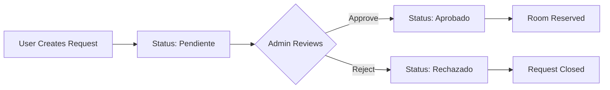

## Try the Live Demo

The easiest way to explore Apartado de Salas is through the live demo:

<Card title="Live Demo" icon="globe" href="https://arakatadevs.com.mx/Portafolio/Apartado-Salas">
  Access the demo at arakatadevs.com.mx/Portafolio/Apartado-Salas
</Card>

### Demo Credentials

Two accounts are available to test different roles:

<CardGroup cols={2}>
  <Card title="Administrator" icon="user-shield">
    **Username**: `admin`  
    **Password**: `1234`
    
    Full access to review, approve, and reject reservations
  </Card>
  
  <Card title="Department Head" icon="user">
    **Username**: `jefe_departamento`  
    **Password**: `1234`
    
    Create and track reservation requests
  </Card>
</CardGroup>

<Note>
  These credentials are for demonstration purposes only. The system contains no sensitive information.
</Note>

## User Workflow: Create a Reservation

Follow these steps to create your first room reservation as a department head.

<Steps>
  <Step title="Log In">
    Navigate to the login page and enter the department head credentials:
    
    ```
    Username: jefe_departamento
    Password: 1234
    ```
    
    After successful login, you'll be redirected to the user dashboard at `/dashboard`.
  </Step>
  
  <Step title="Access Reservation Form">
    From the dashboard, click **"Nueva Reservación"** (New Reservation) or navigate to:
    
    ```
    /reservations/create
    ```
    
    The reservation form includes:
    - Room selection dropdown
    - Event name input
    - Date and time slot manager
    - Material selection (dynamically loaded per room)
    - Notes/observations textarea
  </Step>
  
  <Step title="Fill Out Reservation Details">
    Complete the form with your reservation information:
    
    **Basic Information**
    - Select a room from the dropdown
    - Enter an event name (e.g., "Reunión de Departamento")
    - Add optional notes
    
    **Add Time Slots**
    
    Click **"Agregar horario"** (Add slot) for each date/time needed:
    ```
    Date: 2026-03-15
    Start: 09:00
    End: 11:00
    ```
    
    You can add multiple slots for recurring events or multi-day reservations.
    
    <Info>
      The system validates for scheduling conflicts automatically. If another reservation overlaps with your selected time, you'll receive an error.
    </Info>
  </Step>
  
  <Step title="Select Materials">
    After selecting a room, the material checklist loads automatically via AJAX:
    
    ```javascript
    // Internal API call to /api/materials?room_id=1
    ```
    
    Check the materials you need:
    - Proyector
    - Bocinas
    - Micrófono
    - Pizarrón
    
    <Warning>
      Only materials available for the selected room will appear. Material availability is validated server-side before creating the reservation.
    </Warning>
  </Step>
  
  <Step title="Submit Request">
    Click **"Crear Solicitud"** (Create Request) to submit.
    
    The system performs these validations:
    
    ```php
    // From ReservationController.php:46-57
    if (!$userId || !$roomId || empty($event)) {
        Session::setFlash('error', 'Datos incompletos.');
        // Redirect back
    }
    
    if (count($dates) === 0) {
        Session::setFlash('error', 'Debe agregar al menos un horario.');
        // Redirect back
    }
    ```
    
    On success, you'll see:
    ```
    ✓ La reservación fue creada correctamente.
    ```
  </Step>
  
  <Step title="Track Your Request">
    View your submitted requests from the dashboard or navigate to:
    
    ```
    /reservations/mine
    ```
    
    Each request shows:
    - Event name
    - Room assigned
    - Current status: **pendiente** (pending)
    - Creation date
    - Action buttons to view details
  </Step>
</Steps>

## Administrator Workflow: Review Requests

Log out and log back in with administrator credentials to review the request.

<Steps>
  <Step title="Log In as Admin">
    Use the administrator account:
    
    ```
    Username: admin
    Password: 1234
    ```
    
    The admin dashboard shows:
    - Total pending requests
    - Recent reservation activity
    - Quick access to approval queue
  </Step>
  
  <Step title="View All Requests">
    Navigate to **"Solicitudes"** (Requests) or:
    
    ```
    /reservations
    ```
    
    Filter by status using query parameters:
    ```
    /reservations?status=pendiente
    /reservations?status=aprobado
    /reservations?status=rechazado
    ```
  </Step>
  
  <Step title="Review Request Details">
    Click **"Ver detalle"** (View details) on any request:
    
    ```
    /reservations/show?id=1
    ```
    
    The detail view displays:
    - Event information
    - Requesting user
    - Room assignment
    - All scheduled time slots
    - Selected materials with quantities
    - Notes from requester
    - Current status
  </Step>
  
  <Step title="Approve or Reject">
    Make your decision using the action buttons:
    
    **Approve Request**
    ```php
    POST /reservations/approve
    { "id": 1 }
    ```
    
    **Reject Request**
    ```php
    POST /reservations/reject
    { "id": 1 }
    ```
    
    The status updates immediately:
    ```php
    // From ReservationController.php:196
    $reservationModel->updateStatus((int)$id, 'aprobado');
    Session::setFlash('success', 'Solicitud aprobada correctamente.');
    ```
  </Step>
</Steps>

## Understanding the Reservation Lifecycle

Every reservation goes through this workflow:



### Status Values

- **pendiente**: Awaiting administrator review
- **aprobado**: Approved and confirmed
- **rechazado**: Rejected by administrator

## Multi-Slot Reservations

The system supports multiple time slots per reservation, perfect for:

- **Recurring meetings**: Same room, multiple dates
- **Multi-day events**: Conference spanning several days  
- **Split sessions**: Morning and afternoon slots

### Example: Weekly Meeting

```php
// Single reservation with 4 weekly slots
Event: "Reunión Semanal de Coordinación"
Room: Sala de Juntas

Slots:
- 2026-03-08  14:00-16:00
- 2026-03-15  14:00-16:00
- 2026-03-22  14:00-16:00
- 2026-03-29  14:00-16:00

Materials: Proyector, Bocinas
```

All slots are validated for conflicts:

```php
// From ReservationController.php:86-88
if ($slotModel->hasConflict((int)$roomId, $date, $start, $end)) {
    throw new Exception("Conflicto de horario el $date de $start a $end.");
}
```

## Transaction Safety

Reservations use database transactions to ensure data integrity:

```php
// From ReservationController.php:64-117
try {
    $db->beginTransaction();
    
    // 1. Create reservation record
    $reservationId = $reservationModel->create(...);
    
    // 2. Create all time slots
    foreach ($dates as $index => $date) {
        $slotModel->create($reservationId, $date, $start, $end);
    }
    
    // 3. Attach materials
    $reservationModel->attachMaterials($reservationId, $materials);
    
    $db->commit();
} catch (Exception $e) {
    $db->rollBack();
    // Handle error
}
```

If any step fails, the entire reservation is rolled back.

## Next Steps

<CardGroup cols={2}>
  <Card title="Creating Reservations" icon="calendar-plus" href="/guides/creating-reservations">
    Detailed guide for users creating and managing reservations
  </Card>
  
  <Card title="Managing Requests" icon="clipboard-check" href="/guides/managing-requests">
    Administrator guide for reviewing and processing requests
  </Card>
  
  <Card title="Authentication System" icon="lock" href="/features/authentication">
    Learn how roles and permissions control access
  </Card>
  
  <Card title="Reservation Features" icon="book-open" href="/features/reservations">
    Deep dive into conflict detection and multi-slot support
  </Card>
</CardGroup>
